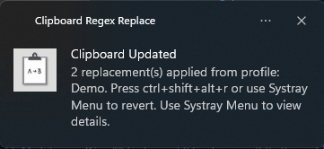

# Clipboard Regex Replace [](https://github.com/TanaroSch/Clipboard-Regex-Replace-2/releases/latest) [](https://opensource.org/licenses/MIT)

**Instantly transform clipboard text using custom rules and global hotkeys.**

Clipboard Regex Replace is a lightweight, standalone Go application that runs in your system tray. It monitors your keyboard for global hotkeys you define. When triggered, it automatically applies a series of predefined regex rules (including securely stored secrets) to your clipboard text, updates the clipboard, and optionally simulates a paste action. Manage rules, secrets, and profiles easily via the system tray menu.

---

## ✨ Quick Demo


---

## Key Features

*   🚀 **Global Hotkey Trigger:** Process clipboard content instantly with configurable hotkeys (e.g., `Ctrl+Alt+V`).
*   🔧 **Powerful Regex Rules:** Define complex text replacements using regular expressions in `config.json`.
*   🔒 **Secure Secret Management:** Store sensitive data (API keys, emails) securely in your OS keychain/credential store, referenced via `{{secret_name}}`. ([Details...](docs/FEATURES.md#secure-secret-management))
*   ⚙️ **Multiple Profiles:** Organize rules into different profiles, each with its own hotkey(s). Toggle profiles on-the-fly. ([Details...](docs/FEATURES.md#multiple-profile-support))
*   ➕ **Easy Rule/Secret Addition:** Add simple text replacements or manage secrets directly from the system tray menu using native dialogs. ([Details...](docs/FEATURES.md#adding-simple-rules-via-system-tray))
*   📋 **Clipboard Automation:** Automatically updates the clipboard and simulates a paste (Ctrl+V).
*   ↔️ **Bidirectional & Case-Preserving:** Configure rules to reverse replacements or maintain original text casing. ([Details...](docs/FEATURES.md#case-preserving-and-reversible-replacements))
*   👁️ **Change Diff Viewer:** See exactly what changed with a browser-based diff view after each operation.
*   📌 **System Tray Control:** Manage profiles, secrets, rules, view diffs, revert changes, reload config, and quit – all from the systray icon.
*   🔔 **Configurable Notifications:** Separately control notifications for administrative events (errors, reloads, etc.) with verbosity levels and for successful clipboard replacements. ([Details...](docs/CONFIGURATION.md#configuration-options-explained))
*   💻 **Cross-Platform:** Runs on Windows, macOS, and Linux X11 (Kubuntu/Ubuntu). Native features adapt to the OS. ([Linux Setup Guide](docs/LINUX_SUPPORT.md))
*   📦 **Standalone:** Single executable file (plus external `config.json`).

➡️ **See [docs/FEATURES.md](docs/FEATURES.md) for in-depth explanations of key features.**

---

## Example Use Cases
*   **Sanitize for LLMs & Public Pasting:** Automatically redact API keys, passwords, PII, internal server names, or other sensitive data from logs, code, or configs *before* pasting into LLMs (ChatGPT, Claude, etc.), public forums, or issue trackers.
*   **Prepare Code Snippets:** Clean up code formatting (whitespace, indentation), remove debug statements, or standardize variable names in snippets prior to sharing or using them in LLM prompts.
*   **Anonymize Configurations & Logs:** Quickly replace specific project names, client identifiers, or user details with generic placeholders when sharing configurations or log excerpts externally.
*   **Streamline Repetitive Cleaning:** Automate any frequent text transformations, such as removing tracking parameters from URLs, fixing common typos, or standardizing date/time formats before pasting.
*   **Combine Complex Edits:** Chain multiple redaction, formatting, and cleanup rules under a single hotkey press for efficient preparation of complex text for specific destinations.
---

## Quick Start

### Windows

1.  **Download:** Grab the latest release from the [Releases Page](https://github.com/TanaroSch/Clipboard-Regex-Replace-2/releases) (Link needs updating if it's a different repo).
2.  **Configure:**
    *   Place the executable in a folder.
    *   Copy the `config.json.example` file to the same folder and rename it to `config.json`.
    *   Edit `config.json` to define your desired hotkeys, notification settings, and replacement rules (see [Configuration](#configuration) below).
3.  **Run:** Double-click the executable (or run from terminal). A system tray icon should appear.
4.  **(Optional) Add Secrets:** Right-click the systray icon -> Manage Secrets -> Add/Update Secret... (Requires app restart after adding/removing secrets).
5.  **(Optional) Add Simple Rules:** Right-click the systray icon -> Add Simple Rule... (Requires Config Reload).
6.  **(Optional) Autostart on Startup:** Don't create a shortcut to the .exe itself, create a shortcut of the ```CliboardRegexReplace.bat``` and place it in the startup folder instead.
7.  **Use:** Copy text, press your configured hotkey, and paste!

### Linux (Kubuntu/Ubuntu)

1.  **Install Dependencies:**
    ```bash
    sudo apt install -y libx11-dev xclip xdotool xdg-utils
    ```
2.  **Build or Download:**
    *   **Option A - Build from source:**
      ```bash
      go build -o clipboardregexreplace cmd/clipregex/main.go
      chmod +x clipboardregexreplace
      ```
    *   **Option B - Download** from [Releases Page](https://github.com/TanaroSch/Clipboard-Regex-Replace-2/releases)
3.  **Configure:** Copy `config.json.example` to `config.json` and edit as needed.
4.  **Run:** `./clipboardregexreplace` (A system tray icon should appear)
5.  **Autostart:** See detailed instructions in [docs/LINUX_SUPPORT.md](docs/LINUX_SUPPORT.md)

📖 **Full Linux Documentation:** [docs/LINUX_SUPPORT.md](docs/LINUX_SUPPORT.md)

---

## Screenshots

*   **Systray Menu:**<br>
    <br>
    <br>
    
*   **Diff Viewer:**<br>
    
*   **Add Simple Rule Dialog:**<br>
    <br>
    <br>
    
*   **Notification Example:**<br>
    

---

## Configuration

The application uses a `config.json` file in the same directory as the executable to define global settings, secrets, notification preferences, and rule profiles.

➡️ **See [docs/CONFIGURATION.md](docs/CONFIGURATION.md) for detailed structure and examples.**

---

## Usage

1.  **Running the Application:**
    *   **From Release:** Double-click the downloaded executable (e.g., `.exe` on Windows).
    *   **From Source (Dev):** Run `go run cmd/clipregex/main.go` in your terminal.
    *   The application runs in the background. Look for its icon in your system tray.

2.  **Managing Secrets (First Time / Updates):**
    *   Right-click the system tray icon.
    *   Select **Manage Secrets** -> **Add/Update Secret...**.
    *   Follow the native dialog prompts to enter a logical name (e.g., `my_email`) and the actual secret value.
    *   Optionally let the app create a basic replacement rule for you.
    *   **Important:** **Manually restart the application** (Systray Menu -> Restart Application) for the new secret to be usable in your `{{...}}` placeholders.

3.  **Adding a Simple Rule:** (Introduced in v1.7.1)
    *   Right-click the system tray icon.
    *   Select **Add Simple Rule...**.
    *   Follow the native dialog prompts to select a profile, enter the exact source text to find, the replacement text, and choose case sensitivity (Yes/No).
    *   After the rule is added to `config.json`, use **Reload Configuration** from the system tray menu to activate it without restarting the app.

4.  **Triggering Clipboard Processing:**
    *   Copy some text to your clipboard.
    *   Press a hotkey configured in your `config.json` (e.g., `Ctrl+Alt+V` for the default profile).
    *   The application performs these steps automatically:
        1.  Reads current clipboard text.
        2.  Resolves any `{{secret_name}}` placeholders using secrets from the OS keychain.
        3.  Applies matching regex rules from enabled profiles associated with that hotkey.
        4.  Updates the clipboard with the transformed text.
        5.  Simulates a paste action (like pressing Ctrl+V).
        6.  Shows a notification (if enabled via `notify_on_replacement`).

5.  **Viewing Changes:**
    *   Immediately after a transformation occurs via hotkey:
    *   Right-click the system tray icon.
    *   Select **View Last Change Details**. This opens a detailed HTML diff report in your default web browser, highlighting the changes made.

6.  **Using Reverse Replacements (if configured):**
    *   Copy text that contains content previously replaced by a profile with a `reverse_hotkey`.
    *   Press the configured `reverse_hotkey` for that profile.
    *   The application attempts to reverse the transformation based on the rules defined (using `reverse_with` if specified, or deriving from the `regex`).

7.  **Reverting to Original Clipboard:**
    *   If `temporary_clipboard` is enabled in `config.json` and `automatic_reversion` is disabled:
    *   Either press the global `revert_hotkey` (if defined in `config.json`).
    *   Or right-click the systray icon and select **Revert to Original**.
    *   This restores the clipboard content to what it was *before* the last hotkey-triggered transformation.

8.  **Editing Configuration:**
    *   Right-click the systray icon -> **Open Config File**. This opens `config.json` in your system's default text editor.

9.  **Reloading Configuration:**
    *   Right-click the systray icon -> **Reload Configuration**.
    *   Applies changes saved in `config.json` (like modified rules, profile enable/disable toggles, global settings) **without** restarting the application.
    *   **Note:** This does *not* load newly added secrets or register hotkeys for newly added profiles/rules. Use "Restart Application" for those changes.

10. **Restarting Application:**
    *   Right-click the systray icon -> **Restart Application**.
    *   Recommended after using "Manage Secrets" or making significant changes to profiles/hotkeys in `config.json`.

11. **Exiting the Application:**
    *   Right-click the systray icon -> **Quit**.

---

## Contributing & Building

Information about requirements, building from source, project structure, and dependencies can be found in [docs/CONTRIBUTING.md](docs/CONTRIBUTING.md).

---

## Changelog

See [docs/CHANGELOG.md](docs/CHANGELOG.md) for the detailed version history.

---

## License

This project is licensed under the MIT License. See the [LICENSE](LICENSE) file for details.